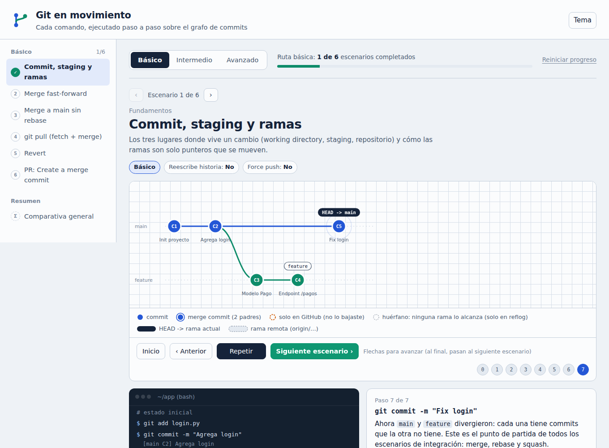
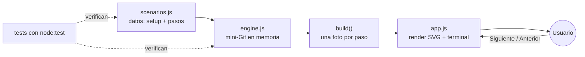

# Git en movimiento

Un simulador visual para entender, de una vez por todas, qué le pasa al historial cuando hacés `merge`, `rebase`, `squash`, `reset`, `revert`, `cherry-pick` o un `push --force`.



> Demo en vivo: **[git-en-movimiento.vercel.app](https://git-en-movimiento.vercel.app)**

## Por qué lo hice

Llevo tiempo usando Git todos los días y, aun así, había comandos que ejecutaba "de memoria" sin tener del todo claro qué pasaba por debajo. ¿Por qué después de un rebase me pide force push? ¿Qué diferencia real hay entre los tres botones de merge de un Pull Request? ¿Qué se pierde con `reset --hard` y qué se puede recuperar?

Las explicaciones que encontraba eran texto o diagramas estáticos. Lo que me faltaba era **ver el grafo moverse**: los punteros deslizándose, los commits nuevos apareciendo con otro SHA, los viejos quedando huérfanos. Así que lo construí.

## Qué podés hacer

- **Ver 16 escenarios paso a paso**, cada uno con su comando, la salida real que mostraría la terminal y una explicación de lo que acaba de pasar.
- **Seguir una ruta de aprendizaje** en tres niveles (básico, intermedio y avanzado, acumulativos), con progreso guardado en tu navegador. El botón "Siguiente" te lleva de un escenario al próximo sin tener que buscar nada.
- **Comparar estrategias** en una tabla: qué reescribe historia, qué requiere force push, qué es seguro en ramas compartidas.
- **Leer pros, contras y cuándo usar** cada operación, escritos desde la práctica y no desde la documentación oficial.

| Nivel | Escenarios |
|---|---|
| Básico | Commit, staging y ramas, Merge fast-forward, Merge sin rebase, `git pull`, Revert, PR: Create a merge commit |
| Intermedio | Merge con rebase, `git pull --rebase`, Squash merge, PR: Squash and merge, PR: Rebase and merge, Cherry-pick |
| Avanzado | Rebase + `--no-ff`, Reset (soft, mixed, hard), Force push, `--force-with-lease` |

Los dos escenarios de force push usan a propósito el mismo caso: una compañera (Ana) pushea un commit mientras vos rebaseás. Con `--force` ese commit desaparece de GitHub sin aviso; con `--force-with-lease` el push se rechaza y nada se pierde. Verlo lado a lado explica mejor que cualquier párrafo por qué conviene el segundo.

## Cómo funciona

No hay Git real corriendo. Escribí un **mini-Git en memoria** que modela solo lo necesario para explicar el grafo: commits con sus padres, ramas locales, ramas remotas, lo último que tu repo "vio" del remoto (lo que usa `--force-with-lease`) y un área de trabajo simplificada.



1. Cada escenario declara un estado inicial y una lista de pasos (comando, operación y explicación).
2. `build()` ejecuta el escenario completo **una sola vez** y guarda una foto inmutable del estado después de cada paso.
3. La UI solo dibuja fotos. Avanzar o retroceder es elegir otra foto, no "deshacer" operaciones. Por eso ir para atrás nunca falla ni deja estados raros.
4. El SVG se actualiza por claves (cada commit y cada rama tienen su elemento). Así las ramas se deslizan animadas en lugar de redibujarse de golpe.

### Estructura

```
├── index.html          # estructura de la página
├── css/styles.css      # tema claro/oscuro con variables CSS
├── js/
│   ├── engine.js       # mini-Git: commit, merge, rebase, push, fetch, reset...
│   ├── scenarios.js    # los 16 escenarios, la ruta y los niveles
│   └── app.js          # render, controles, progreso y configuración
├── test/               # tests del motor y de cada escenario
├── vercel.json         # headers de seguridad (CSP) y caché
└── .github/workflows/  # CI que corre los tests en cada push
```

## Decisiones que tomé

**Sin framework ni build.** Es HTML, CSS y JavaScript plano. Para una herramienta estática de este tamaño, React o un bundler sumaban dependencias y un paso de build sin aportar nada. Se abre con doble clic y se despliega en cualquier hosting estático.

**Sin dependencias, ni siquiera para testear.** Los tests usan `node:test`, que viene con Node. `npm install` no es necesario.

**Motor separado de la UI.** `engine.js` y `scenarios.js` funcionan tanto en el navegador como en Node. Eso permite testear la lógica de Git sin abrir un navegador, y garantiza que cada escenario sea coherente: ninguna rama apunta a un commit inexistente y ningún commit tiene padres fantasma.

**Configuración en un solo lugar.** Las medidas del grafo, el tiempo de autoplay y el prefijo de almacenamiento están en el objeto `CONFIG` al inicio de `app.js`.

**Seguridad aunque sea un sitio estático.** No hay scripts ni estilos inline, así que la Content Security Policy de `vercel.json` puede ser estricta (`script-src 'self'`). El único recurso externo es Google Fonts, con fuentes de sistema como respaldo.

**Datos ficticios a propósito.** Lo que parece hardcodeado (`github.com:equipo/app.git`, "Ana", los mensajes de commit) es contenido de la simulación, no configuración real.

## Qué dejé afuera (por ahora)

- **Conflictos de merge.** Mostrarlos bien implica simular contenido de archivos, no solo el grafo. Es otro proyecto.
- **`rebase -i`, `stash`, `bisect`.** Son buenos candidatos para una segunda tanda de escenarios.
- **Un Git real por debajo** (por ejemplo con isomorphic-git). Daría fidelidad total, pero sumaría peso y complejidad para un objetivo que es pedagógico.
- **Progreso sincronizado entre dispositivos.** Se guarda en `localStorage`, así que cada navegador lleva su propio avance. Para una herramienta sin cuentas, me pareció el trade-off correcto.

## Correrlo localmente

Abrí `index.html` en el navegador. Eso es todo.

Si preferís levantarlo con un servidor local:

```bash
npm start          # sirve el proyecto en http://localhost:3000
```

## Tests

```bash
npm test
```

Cubren las operaciones del motor (fast-forward, merge de tres vías, rebase, squash, cherry-pick, reset, revert, push rechazado, force y force-with-lease) y ejecutan los 16 escenarios completos verificando la integridad del grafo en cada paso. Corren automáticamente en GitHub Actions con cada push y cada Pull Request.

## Deploy en Vercel

1. Importá el repo desde Vercel.
2. Framework preset: **Other**. Sin build command; el directorio de salida es la raíz.
3. Deploy. Los headers de seguridad se aplican solos desde `vercel.json`.

## Licencia

MIT. Usalo, adaptalo para tu equipo o tus clases, y si le agregás escenarios, me encantaría verlos.
